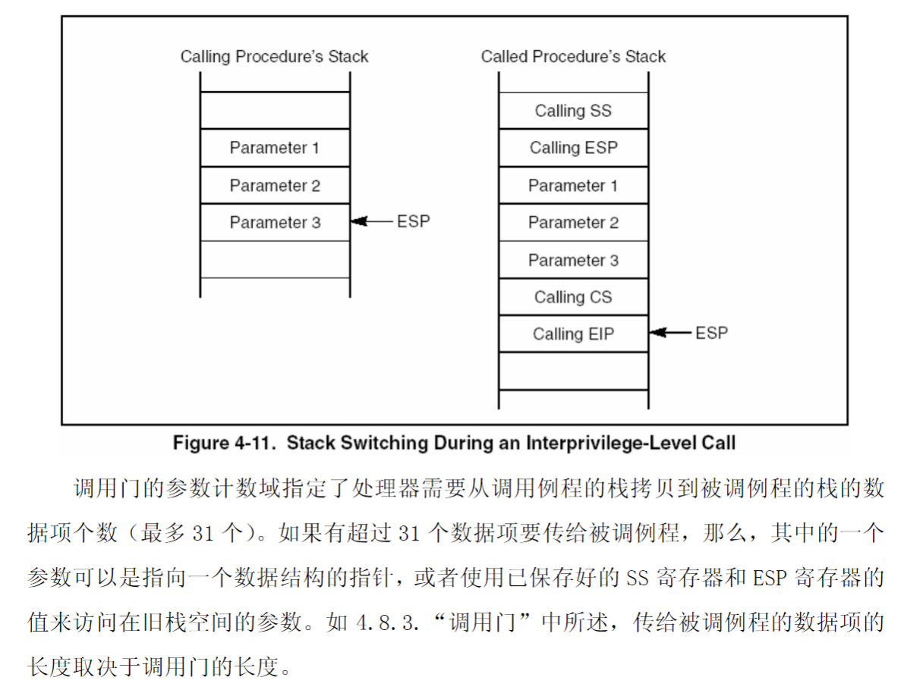

# recode

## A

- cpu设置刚开始加点 16位实模式，CS=0xF000,IP=0xFFF0, CS:IP=0xFFFF0.
    - 这也就是BIOS第一条指令的位置。
    - BIOS将第一山区的程序加载到指定位置。
        - 设计中断向量表、BIOS数据区、中断服务程序。
- bootsect.s
    - 移动自身512B（0x7C00 -> 0x9000）。
        - 跳转到0x9000对应的代码位置。
        - 加载512B的setup.s 到 0x9000:0x200
        - 加载操作系统到0x1000:0x000处。
        - 调换到setup起始地址。
- setup.s
    - 加载机器系统数据到0x9000:0x00 ~ 0x9000:0x901FD，即bootsect.s的位置 共 510B.
    - 关中断 然后 将 操作系统从0x1000:0x000处移动到0x000:0x000。
        - 移动完后 实模式下的 中断向量表已经没了。
            - 此时对外部中断不进行处理，例如时钟、硬盘等。因为无法处理？。
    - 设置ldt中断向量表和gdt寄存器。
    - 打开A20 实现32位寻址。 16MB物理地址，4GB线性地址。
    - 对8295A进行重新编程。
    - 设置保护模式【lmsw ax】
    - 跳转到0x000:0x000, jmp:0,8 [8=01 0 00  gdt表0特权第二项]
        - head.s在链接的时候 放在了内核的前面 占用了 25KB+184B。
        - 所以下来执行head.s
- head.s
    - 将会被页表覆盖掉。
    - 通过0x10设置段选择符【ds，es，fs，gs】
        - 设置 sp
    - 设置 idt 表，将所有的 变为 默认的中断服务程序ignore_int
    - 设置 gdt 表，段限长为16MB【setup.s里是8MB】
    - 重新设置段选择符【ds，es，fs，gs】
    - 准备执行main函数，将L6入口地址和main入口地址分别压栈。
    - 设置页表【setup_paging】
        - 先设置了四个页目录项 16MB
        - 再填充四个页中的4096个页表项。【直接映射】
    - 现在的情形
        - 打开A20【可寻址32位】
        - 保护模式【mov ax,#0x0001 ! protected mode (PE) bit】
        - IDT表、GDT表 建立。
        - 页表建立

## main

### 缓冲区

- 先对缓冲区进行规划，处内核代码和数据所占用的内存空间之外，其余物理内存分为主内存区、缓冲区和虚拟盘。
    - 如果定义了虚拟盘【#ifdef RAMDISK】
        - main_memory_start += rd_init(main_memory_start, RAMDISK*1024);
        - 1MB以下，主要是内核大部分数据所在的内存空间，地址关系是【直接映射】。
        - 1MB以上，主要是用户进程的代码、数据所在的内存空间。

### trap 请求项数组、tty、开机时间

- 初始化trap【终端、异常处理】
    - 中断描述符：
        - 其中段选择符 是 8 = 1000 【RPL=00，GDT 第二项内核代码段】
        - 系统门的DPL = 11， 其他是00.
        - 
- 初始化请求项数组。
- tty、开机启动时间。

#### 特权级

- DPL：描述符特权级。
    - 存储在 段或门描述符的DPL域中。描述符第5个字节5-6位。
- RPL：请求特权级。
    - 存储在段选择子的第0位和第1位。
        - 例如：中断描述符 中设置的段选择符为0x0008 表示RPL=00.
        - 段选择子的 RPL 通常可以改变进程或者任务的可寻址范围。如果使用得当，RPL
可以防止低特权的进程或任务有意无意地错误使用特权数据段的段选择子而造成的问
题。
- CPL：当前特权级。
- 特权级校验
    - 访问数据段中的操作数：【4.6 访问数据段时的特权级检查 IA-32-3第79页】
        - 处理其将段选择子装入段寄存器前，先比较CPL段选择子的RPl和段描述符的DPL。
        - 如果DPL >= max(CPL, RPL) 通过，否则产生一般保护异常。
            - 例如 mov $0x10, %edx  
                - CPL = 当前CS寄存器后两位。
                - RPL = 10000'b 后两位 00。
                - DPL = gdt表第二项内核代码段的DPL = 00.
        - 
    - **调用门的特权检验规则**：【4.8.4.通过调用门访问代码段 P88】
        - **CALL 指令 和 JMP 指令**：
            - CPL <= 调用门 DPL; RPL <= 调用门 DPL
            - 代码段DPL <= CPL
                - 当 CPL > 目标代码段的DPL 时。
                    - CPL 会降级。
                    - 这样做 如果通过了校验，那么用户态可以通过一定方式转到内核态，但**内核态不能直接调用用户态代码**。
                    - 非一致性目标代码段时 会发生栈切换。
        - int 0x80时
            - CPL = 11'b
            - 因为中断和异常向量没有 RPL，所以当显式地调用中断和异常处理程序时，不检验 RPL【P118】
            - DPL = 中断描述符：11'b  指向的数据段描述符：00'b[内核]
        - 

#### 栈切换

使用调用门来转移进程控制到 特权级更高的 非一致性代码段 时，处理器会自动切换栈到目标代码段相应的特权级栈上。

- 为了防止特权级更高的例程因为栈空间的不足而崩溃。
- 特权级较低的进程通过共享栈干扰特权级更高的进程。

因此每个任务都必须在相应的特权级定义相应的栈空间。linux0.11 里面体现的是 ss0，ss。

- 当通过调用门发生了特权级的改变时会发生以下事情：
    - 使用目标代码段的DPL作为CPL，并从TSS中指向新栈的指针。
    - 从TSS中读取要切换的栈的 段选择子和栈指针。
    - 检验 栈段描述符的特权级和类型。
    - 暂时保存当前的 ss 和 esp。
    - 设置ss为新栈段描述符 和 esp为新栈指针。
    - 将保存的旧的ss 和 esp 压入新栈。
    - 将调用门的参数计数域所指定个数的参数从调用例程的栈拷贝到新栈。如果参数个数域为 0，则一个参数也不拷贝。
    - 将返回指令指针【当前cs：ip】压入新栈。
    - 将调用门描述符 中的 代码段段选择符找到 新的cs，以及 调用门描述符中的中断服务程序偏移地址作为 ip，然后开始执行被调例程。
- 其中 栈的内容如下图所示：
    - 

#### 任务切换【P158】

- 发生情况
    - 当前进程 执行 JMP 或 CALL到GDT中的一个TSS描述符。
    - 当前进程 执行 JMP 或 CALL到当前LDT中的一个任务门描述符。
    - 一个中断或者异常向量，它指向 IDT 中的一个任务门描述符
    - 当前任务执行了一个 IRET，此时 EFLAGS 寄存器中的 NT 标志是置位的。
- 任务切换时 执行的操作：
    - 获取新任务的TSS段选择子。
    - **检验是否允许切换：CPL以及段选择子的RPL <= 段描述符的DPL。**
        - 允许异常、中断（INT n 指令产生的中断除外）和 IRET指令等切换任务而不管目的任务门或 TSS 描述符的 DPL。对于 INT n 指令产生的中断，是要检验 DPL 的。
    - 检验新任务的 TSS 描述符标有“存在”标志并且界限合法（大于或者等于 67H）
    - 检验新任务是可用（调用、跳转、异常或中断）或者忙（IRET 返回）的。
    - 检验当前（老）TSS、新 TSS 和所有用于任务切换的段描述符都被分页到系统内存中。
    - 如果是由 JMP 或者 IRET 指令发动的任务切换，则处理器清除当前（老）任务的 TSS 描述符的忙（B）标志；如果是由 CALL 指令、异常或者中断发动的，则忙（B）标志还保持置位。
    - 。。。。
    - **保存当前（老）任务的状态到当前任务的 TSS 中**。处理器从任务寄存器中找出当前 TSS 的基地址，然后复制下列寄存器的状态到当前 TSS 中：所有的通用寄存器、段寄存器中的段选择子、临时保存的 EFLAGS 寄存器映像和指令指针寄存器（EIP）。
    - **用段选择子和新任务的 TSS 描述符加载任务寄存器。**

#### 返回

- 当执行 **远返回** 到调用例程时，处理其进行如下步骤的操作：
    - 检查保存的 原cs 寄存器的 RPL域来确定返回时是否需要改变特权级。
    - 从被调例程的栈上加载CS寄存器和EIP寄存器

### 初始化进程0、时钟中断、0x80

- 初始化进程0
    - 需要设置 task_struct、tss、gdt
    - 进程0的task_struct为 默认的init_struct。

        - ```cpp

         { \
                    {0,0}, \
            /*ldt*/ {0x9f,0xc0fa00}, \
                    {0x9f,0xc0f200}, \
            }, \
            /*tss*/ {0,PAGE_SIZE+(long)&init_task,0x10,0,0,0,0,(long)&pg_dir,\
                    0,0,0,0,0,0,0,0, \
                    0,0,0x17,0x17,0x17,0x17,0x17,0x17, \
                    _LDT(0),0x80000000, \
            {} \
            }, \
    - gdt、ldt、tss 解释：
        - gdt 中 1和2、4和5、6和7...分贝为TSSi和LDTi。
        - 需要注意的是 TSSi、LDTi也是一个段描述符，其中 长度
        - 一个是104B一个是24B。
            - 设置的时候DPL=00.
        - LDTi 中指向了三个段描述符，分别是NULL、代码段描述符、数据段描述符【01011、10011?】
        - TSSi 中描述了当前程序的截面、其中有esp0内核栈，cr3页表寄存器。
        - 
    - 段描述符解释：
        - 
    - 设置time_interrupt、system_call[0x80]
- 设置时钟中断。
- 设置系统调用入口【0x80】

### 缓存

- 初始化缓存 将 main函数开始的缓冲区空间 前面放 buffer_head、后面放b_data
    - 初始化 hash_table、free_list。

### 软盘、硬盘

- 设置 blk_dev中的 request_fn，即对应设备有request请求时执行的函数。
- 初始化软盘和硬盘的 中断处理程序。

### 开启中断

这时候 所有中断处理程序 都设置完毕。
好像还和 中断现场保护用的tss也有关？。

### move_to_user_mode

- 通过手动压栈 ss sp eflags cs ip， 然后iret。

### fork

- int 0x80 system_fork。
- 将**ss sp eflags cs ip 压栈**。 这其中 中断只用比较 CPL 和 DPL， 然后设置CPl 以及 栈切换。
    - 调用 _system_call.
    - _system_call 先检查请求号是否正确。
    - 再将 **ds es fs edx ecx ebx 压栈**。【edx ecx ebx 作为后续参数】
    - 设置 ds,es 为0x10 【RPL=00 gdt表 第一项 CPL=00】
    - 设置 fs 为 0x17 用户数据段
    - 执行 sys_fork函数。【**压入下一条指令的地址。**】
        - 执行find_empty_process 【压入call _find_empty_process下一条指令的地址】
            - 先找到 空闲的 pid。
            - 找到空闲的 task_struct数组 然后返回。【弹出一个地址】
        - 判断find_empty_process是否成功。
        - **压入 gs esi edi ebp eax**。
        - 执行 copy_process 【**压入call_copy_process 下一条指令的地址**】
            - 参数：
                - 这里call 时 好像里面会有 下一条指令的地址以及 sp。
                - 从栈中取参数时 第一个参数对应 16(%esp),跳过了上面两个东西。
            - 首先先获取一个新页来初始化 taks_struct数组。
                - `p = (struct task_struct*)get_free_page();   task[nr] = p;`
            - 然后使用当前进程的 task数组对其初始化。`*p =*current;`
            - 再修改一部分：
                - state、pid、father、counter
                - `p->tss.esp0 = PAGE_SIZE+(long)p`【内核栈】
                - `p->tss.ss0 = 0x10`【内核数据段】
                - ss sp eflags cs ip 设置为 执行 `int 0x80` 的时候的值。
                - 设置
                    - `p->tss.ldt = _LDT(nr); _TSS(n) ((((unsigned long) n)<<4)+(FIRST_TSS_ENTRY<<3))`
                    - 这里<<3 表示 gdt表 RPL=00.
            - 下来执行 `copy_mem(nr, p)`
                - 这里要求 代码段和数据段 段基址要一样。
                - 获取 段基址、段限长。
                - 设置 新的代码段、数据段 段基址 为 nr*64MB
                - 填充 p->ldt[1], p->ldt[2]
                - 执行 `copy_page_tables(old_data_base,new_data_base,data_limit)`
                    - 先检查 是否64MB对齐。
                    - 接着 获取 页目录项 所在的内存地址=`((from>>20) & 0xffc)` 4B
                    - 接着 将 data_limit 4MB对齐。
                    - 下来 遍历每个页目录项：
                        - 接着 `get_free_page` 复制二级页表的内容
                            - `nr = (from==0)?0xA0:1024; \\内核代码长度640KB=160*4K`
                            - 接着将 二级页表的每项 后12个标志位 打上 只读
                                - mem_map 打上标记。
            - 设置父子进程共享文件。
            - 下来设置 gdt表中的对应的2项，tss，ldt。
            - 设置进程可以运行。
            - 通过设置cr3来 刷新高速缓存。
            - 返回进程号。
        - 退栈 **gs esi edi ebp eax** + ret
    - 接着判断 当前进程状态、当前进程剩余时间片，满足条件 去 schedule
        - **shedule**
            - 什么都没有时 切换到 0.
    - **iret**


### 后续

进程0 执行`pause(); schedule();`
然后切换到 进程1 执行 init()

## init

通过bread 读取引导块

- `sys_setup(void * BIOS)`
    - `bread(0x300 + drive*5,0))` 0x300 指的是什么，为什么要drive*5【hd，约定？后面读文件/5】
        - `bh=getblk(dev,block)`
            - 先通过`bh = get_hash_table(dev,block)` 【从已有的块中获取并加锁？】
                - `bh=find_buffer(dev,block)`【找到是否已经存在】
                    - 在hash后的链上找是否有dev和block一样的缓冲块。
                    - 找不到返回NULL。
                    - 找到了返回对应的bh。
                - 如果存在那么 执行`wait_on_buffer(bh)`【等待bh解锁。】
            - 这时候没有找到bh。
            - 下来再 free_list上面找b->count=0下 ((bh)->b_dirt<<1)+(bh)->b_lock 最小的bh【b_dirt会有个b_lock环节】
            - 然后

          ```cpp
          if (!bh) {
              sleep_on(&buffer_wait);
              goto repeat;
          }
          wait_on_buffer(bh);
          if (bh->b_count)
              goto repeat;
          while (bh->b_dirt) {
              sync_dev(bh->b_dev);
              wait_on_buffer(bh);
              if (bh->b_count)
                  goto repeat;
          }
          /* NOTE!! While we slept waiting for this block, somebody else might */
          /* already have added "this" block to the cache. check it */
          if (find_buffer(dev,block))
              goto repeat;
          /* OK, FINALLY we know that this buffer is the only one of it's kind, */
          /* and that it's unused (b_count=0), unlocked (b_lock=0), and clean */
          bh->b_count=1;
          bh->b_dirt=0;
          bh->b_uptodate=0;
          remove_from_queues(bh);
          bh->b_dev=dev;
          bh->b_blocknr=block;
          insert_into_queues(bh);
          return bh;
          ```

            - 后面之所以反复 `goto repeat;` 好像主要是由于 有人把空闲的
        - 根据第0块引导块设置分区信息。
    - `rd_load(void)`
