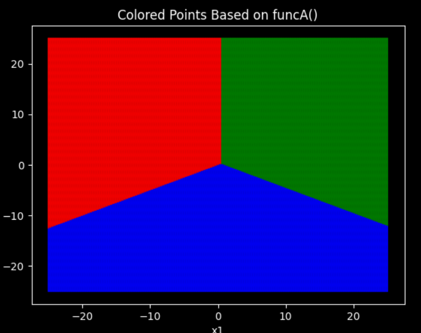

# 作业三

## 1

$
a_1=(0, 1, 0)^T \\
a_2 = (-7, -2, -2)^T \\
a_3 = (-4, 5, 0)^T
$

## 2

交点：(0.5, 0.5)


## 3.1

(a)

$第23步收敛于(-30.4, 34.1, 34.0)^T$

(b)

$第39步收敛于(5.1, 5.1, 31.0)^T$

## 3.2

(a)

$未收敛，返回结果(0.35, -0.25, 0.48)^T\quad 错误率: 10\%$

$\omega_1,\omega_3 线性不可分。$

(b)

$收敛，返回结果(0.57, 0.51, 4.01)^T\quad 错误率: 0\% $

$\omega_2,\omega_4 线性可分。$

## 3.3

正确率：100%

```python
samples = np.vstack((   np.hstack((s1[:8, :], np.ones((8, 1)))), 
                        np.hstack((s2[:8, :], np.ones((8, 1)))),
                        np.hstack((s3[:8, :], np.ones((8, 1)))), 
                        np.hstack((s4[:8, :], np.ones((8, 1)))), ))

samples2 = np.vstack((  np.hstack((s1[8:, :], np.ones((2, 1)))), 
                        np.hstack((s2[8:, :], np.ones((2, 1)))),
                        np.hstack((s3[8:, :], np.ones((2, 1)))), 
                        np.hstack((s4[8:, :], np.ones((2, 1)))), ))

Z = np.full((4, 32), 0)
for i in range(0, 32):
    Z[int(i/8), i] = 1

W = np.linalg.pinv(samples) @ Z.T

b = np.argmax(W.T @ samples2.T, axis=0)
print(b)

## 正确率 百分百。
```
