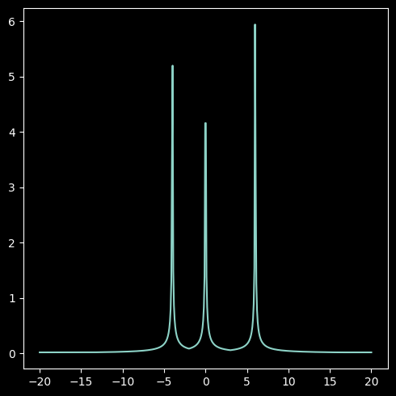
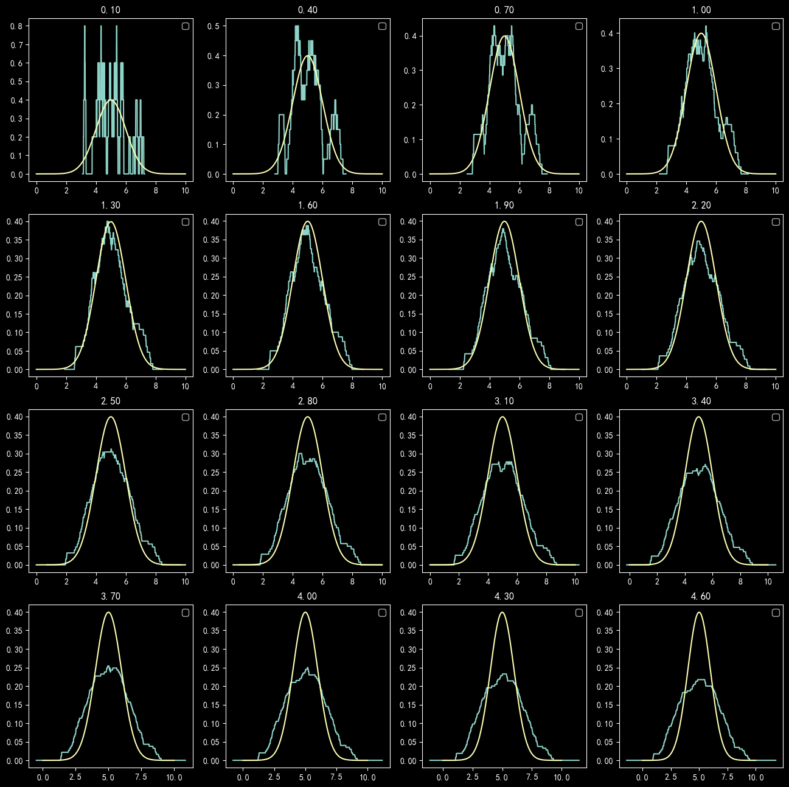
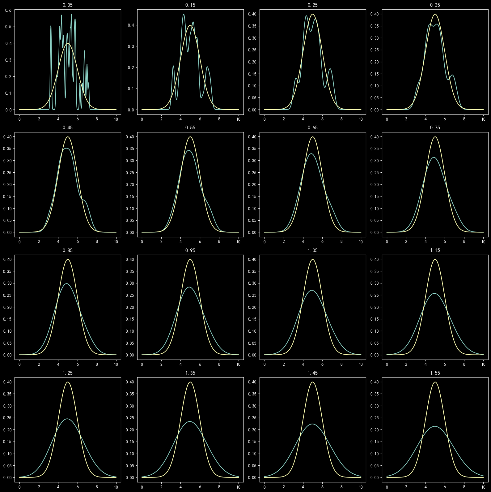

# 作业二

## 第一部分

### 1

$p(x)=\frac{1}{n}\sum\limits_{i=1}^n\delta(x-x_i)\\
\delta(x)=\large\begin{cases}\frac{1}{h_n} & {\rm{|x|\le\frac{h_n}{2}}} \\ 0 &\rm{else}\end{cases}$

### 2

$p(x)=\begin{cases}\frac{1}{6|x+4|} & x\le-2\\ \frac{1}{6|x|} & -2\le x\le 3\\ \frac{1}{6|x-6|} &x \ge 3\end{cases}$

### 3

- EM算法步骤
  - 初始化$\,\theta^{\,old}$
  - Repeat
    - E step: $基于当前\,\theta^{\,old}和样本，估计隐变两的后验分布\,p(z_i\,|\,x_i,\theta^{\,old})，并计算Q(\theta,\theta^{old}):$
      - $\begin{aligned} \large Q(\theta,\theta^{old})&=\sum\limits_{i}E_{p(z_i|x_i,\theta^{old})}[\ln(p(x_i,z_i|\theta)))\\ &=\sum\limits_{i}\sum\limits_{z_i}p(z_i|x_i,\theta^{old})\ln(p(x_i,z_i|\theta)\end{aligned}$
    - M step: $更新参数\theta$：
      - $\theta^{new}=\rm{arg \;\underset{\theta}{min}}\; Q(\theta,\theta^{old})$

### 4

$\begin{aligned} Q(\theta,\theta^{Old}) &= \sum\limits_{i}\sum\limits_z\Big(p(z|x_i,\theta^{old})\,\ln(\pi_z\mathcal{N}(x_i,\mu_z,\Sigma_z)\Big) \quad \Big[\,\rm{let}\;{\Huge\epsilon}_{zi}=p(z|z_i,\theta^{old})\,\Big] \\ &=\sum\limits_i \sum\limits_z{\Huge\epsilon}_{zi}\Big(\,\ln(\pi_z)-\frac{d}{2}\ln(2\pi)-\frac{1}{2}\ln(|\Sigma|_z)-\frac{1}{2}(x_i-\mu_z)^T\Sigma_z^{-1}(x_i-\mu_z)\,\Big)\end{aligned}$

### 5

- 基本任务
  - 通过拟合观测序列，确定HMM中的参数，即$\,\theta=(\pi,A,B)\quad [\,Z为隐变量？\,]$
  - EM算法步骤
    - E step：对给定$\,\theta\,$估计：$q(z_1,\dots,z_n)=p_\theta(z_1,\dots,z_n|x_1,\dots,x_n)$
    - M step：用估计的$\,q(z_1,\dots,z_n)，更新\theta$：
      - $\theta=\rm{arg\;\underset{\theta}{max}}\sum\limits_z\,q(z_1,\dots,z_n)\,\ln\Big(p_\theta (x_1,\dots,x_n,z_1,\dots,z_n)\Big)$
      - $\begin{aligned} \pi_k&=q(z_1=k) \\ A_{i,j}&=\frac{\sum_{i=2}^nq(z_{t-1}=i,z_t=j)}{\sum_{i=2}^n\sum_{k=1}^Kq(z_{t-1}=i,z_t=k)}\\ B_{i,j} &= \frac{\sum_{t=1}^nI\{x_t=j\}q(z_t=i)}{\sum_{t=1}^nq(z_t=i)} \end{aligned} $

## 第二部分

### 方窗估计

随着窗宽的增大，概率密度曲线由脉冲函数变得与原曲线拟合，图像逐渐平滑。

当窗宽继续增大时，概率密度曲线逐渐过度平滑，拟合度变低。

### 高斯窗估计

随着窗宽的增大，概率密度曲线由脉冲函数变得与原曲线拟合，图像逐渐贴近。

当窗宽继续增大时，概率密度曲线逐渐过度平滑，拟合度变低。

