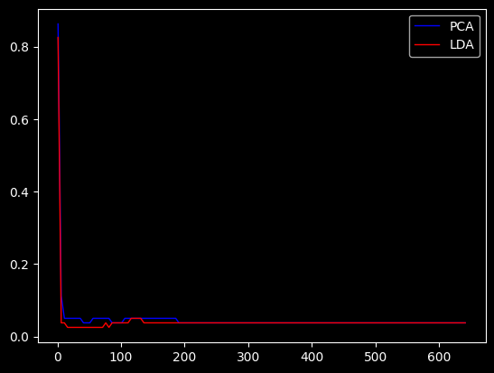
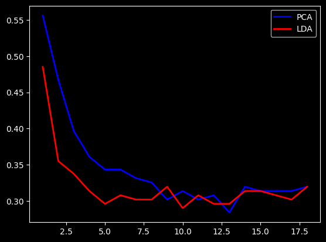

# 作业5

## 第一部分

### 1

原理：寻找一组方差较大的方向，将原始数据（样本）在这 些方向上进行投影。即将数据 在新坐标系下进行表示，保留 少数在方差最大方向上的投影 ，达到尽可能地保留原始数据 信息和降维的目的。 方差较大的方向称为主成分 (Principal Components) 。其中 ，方差最大的方向称为第一主 成分，其次为第二主成分，依 次类推。

学习模型：$\underset{W\in R^{m*d}}{max} tr(W^TCW)=\sum_{i=1}^d w_i^TCw_i\quad W^TW=I\quad C=\sum_{i=1}^n(x_i-\overline{x})^T(x_i-\overline{x})$

算法步骤：先计算协方差矩阵$C$、再对$C$进行特征值分解，取特征值最大的$d$个所对应的特征向量作为变换矩阵。

### 2

原理：寻找一组投影方 向，使样本在投影之后 （即在新坐标系下）类 内样本点尽可能靠近， 类间样本点尽可能远离 ，提升样本表示的分类 鉴别能力。

学习模型：$\max{w^TS_bw},\quad s.t. \quad w^TS_ww=1$

算法步骤：$先计算类内散度矩阵S_w和类间散度矩阵S_b,再对S_w^{-1}S_b进行特征值分解，取特征值最大的d个所对应的特征向量作为变换矩阵。$

### 3

基本思想：高维空间相似的数据点，映射到低维空间距离也是相似的。

### 4

- 过滤式特征选择方法： “选择”与“学习”独立 ，在特征选择和分类器训练之前独立地进行。常见方法有方差选择、互信息等。

- 包裹式特征选择方法： “选择”依赖“学习” ，使用具体的分类器性能来评估特征子集。典型方法有递归特征消除（RFE）等。

- 嵌入式特征选择方法： “选择”与“学习”同时进行，特征选择与分类器训练过程融为一体。典型方法有LASSO回归、决策树等。

## 第二部分

### 编程实现1

### 编程实现2

