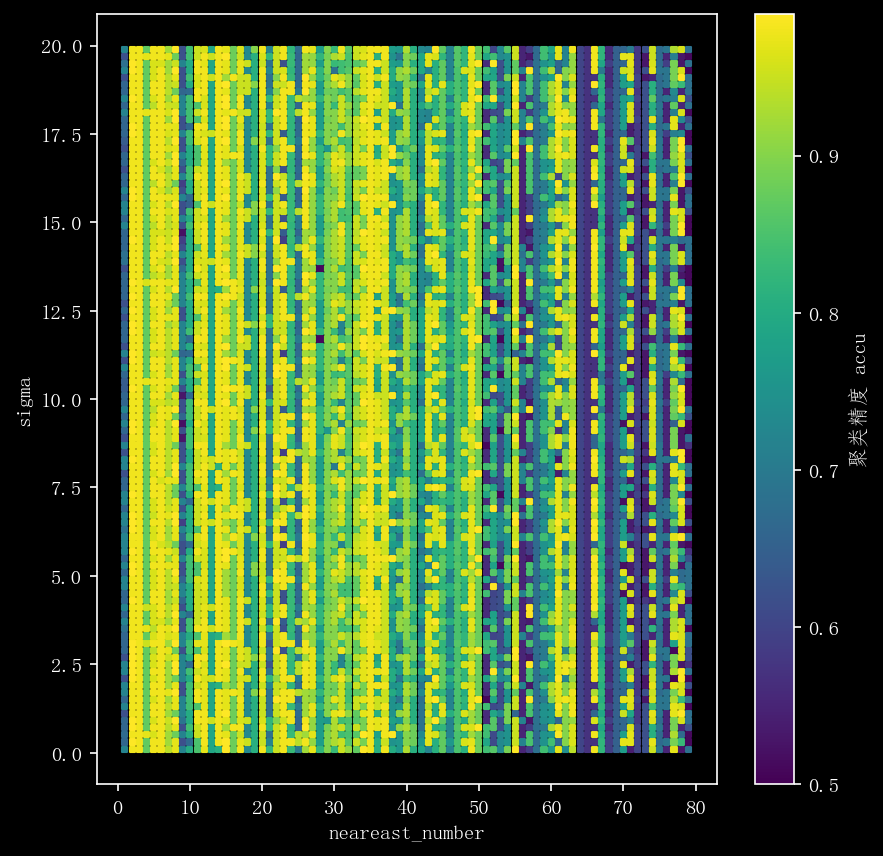

# 第六次作业

## 第一部分

### 1.1

设计思想：
给定训练集，寻找比较粗糙的分类规则 （弱分类器）要比寻找精确的分类规则要简单得多。 从弱学习算法出发，反复学习，得到一系列弱分类器； 然后组合这些弱分类器，构成一个强分类器。

计算步骤：

---

$
Input:\\
\;\;train\;dataset(X, Y)=\{(x_1,y_1),(x_2,y_2),\cdots,(x_N,y_N),\} y_i\in\{-1,+1\};\\
Output: \\
initialize\;eachs\;sample\;weight:D_{1,i}=\frac{1}{N},i=1,2,\dots,N,and \;f_0(x)=0\\
for\;m=1\;to\;M\;do\\
\quad train\;a\;base\;learner:G_m(x)\\
\quad calculate\;error\;ratio:e_m=\sum_{i=1}^ND_{m,i}I(G_m(x_i)\ne y_i)\\
\quad if\;e_m\gt0.5\;then\;break\\
\quad \alpha_m=\frac{1}{2}\ln(\frac{1-e_m}{e_m})\\
\quad update\;sample\;weight:D_{m+1,i}=\frac{D_{m,i}}{Z_m}.\exp\{-\alpha_my_iG_m(x_i)\}\\
\quad Z_m=\sum_{i=1}^ND_{m,i}.\exp\{-\alpha_my_iG_m(x_i)\}\\
\quad f_m(x) = f_{m-1}(x) + \alpha_mG_m(x)
end\;for\\
return \; G(x) = sign(f_M(x)) = sign(\sum_{m=1}^M\alpha_MG_m(x))
$

---

### 1.2

说明：
K-means 可以看作是 已知成分密度相同，样本协方差矩阵为单位阵且样本$x_i$只来自于一个成分时的混合高斯模型函数估计。
具体为 $\\max\;Q(\mu,\mu^{old})=E_{p(R|X,\mu)}\ln P(X|R,\mu)=\sum_i\sum_jr_{ij}\ln N(x_i|u_j,I)\\s.t.\quad r_i^Tr_i=1,r_{ij}\in Z$

$E\;step:\;r_{ij}=\left\{\begin{aligned}1,\quad&N(x_i|u^{old}_j,I)=\underset{k}{\max}\{N(x_i|u_k^{old},I)\}\\0,\quad&otherwise\end{aligned}\right.\\
M\;step:\;带入r_{ij}后\displaystyle\frac{\partial Q(\mu,\mu^{old})}{\partial \mu^{old}}=0\implies\mu_k=\frac{\sum_ir_{ik}x_i}{\sum_ir_{ik}}$

计算步骤：

1. 初始化聚类中心。
2. 根据离聚类中心的距离为每个样本分类。
3. 根据分类后的样本平均值更新聚类中心。

影响因素：

1. 初始化聚类中心。
2. 样本的分布。
3. 初始聚类中心个数。
4. 各个真实类别的个数是否大致相同。

### 1.3

原理：谱聚类算法建立在图论的谱图理论基础之上，其本质是将聚类问 题转化为一个图上的关于顶点划分的最优问题。

计算步骤（Ng）：

1. 首先根据设定值求出$L_{sym}$矩阵。
2. 求出$L_{sym}$的最小的k个特征向量。
3. 将其构成的n*k的矩阵每一行标准化 为$U$
4. 将$U$的每一行视为第i个样本的新的表现形式，再做k-means聚类。

影响因素：

1. 相似矩阵的构建形式：核函数，相似性度量。
2. 特征向量的选择。
3. 数据的分布。
4. 数据的规模。

## 第二部分

### 2.1

（1） 见1.ipynb

（2）

```cpp
Converged after 4 iterations.
初始化聚类中心：
[[ 4.09298564  5.4544782  -0.22003364 -0.28961308  8.76535038]
 [-5.42363245  3.32215186  3.2752437   0.40352397 -1.53679861]]
初始化聚类中心与所对应的真实分布均值之间的误差：[1.68308832 1.29804479 1.41906792 1.90603815 1.55460941]
聚类中心与所对应的真实分布均值之间的误差：[0.12708637 0.13054112 0.02570909 0.09866502 0.10066848]
聚类精度: 99.10%, 错误个数:9

初始化聚类中心：
[[ 5.10605424e+00  5.86745932e+00  2.08743488e+00  2.23845117e+00
   3.59963489e-01]
 [-4.63420640e+00  5.49477320e+00  4.97976217e+00  2.41510142e-03
  -2.73889607e+00]]
初始化聚类中心与所对应的真实分布均值之间的误差：[0.41617859 1.00356402 1.46371054 6.76154926 1.8529453 ]
聚类中心与所对应的真实分布均值之间的误差：[1.8814134  1.35807311 0.09160522 7.44066697 0.92599906]
聚类精度: 68.70%, 错误个数:313

初始化聚类中心：
[[-1.73010032  8.04472463  1.93683547  0.54900237  7.05323925]
 [ 3.43462376  0.70622027 -3.21079076 -2.23927069  3.79231456]]
初始化聚类中心与所对应的真实分布均值之间的误差：[2.78802763 1.18798069 3.78922181 1.3187838  1.26890961]
聚类中心与所对应的真实分布均值之间的误差：[0.02570909 0.10066848 0.12708637 0.09866502 0.13054112]
聚类精度: 99.10%, 错误个数:9

初始化聚类中心：
[[ 0.60627426  7.31680338  5.11771542  5.71287585  2.87084883]
 [ 3.20995806 -1.19917407 -6.15399955  4.32721265 -2.31757871]]
初始化聚类中心与所对应的真实分布均值之间的误差：[0.88271526 2.06668075 1.69760302 0.33510558 2.2882502 ]
聚类中心与所对应的真实分布均值之间的误差：[0.02570909 0.10066848 0.12708637 0.13054112 0.09866502]
聚类精度: 99.10%, 错误个数:9

初始化聚类中心：
[[ 6.69814153  4.28422062 -0.19813166  1.34491164  6.01801352]
 [ 5.77132967 -5.9333585  -1.12116518  4.11461036  3.69783908]]
初始化聚类中心与所对应的真实分布均值之间的误差：[1.45040709 1.87953081 1.2042427  0.36345505 4.75039548]
聚类中心与所对应的真实分布均值之间的误差：[0.13054112 0.12708637 0.09866502 0.02570909 0.10066848]
聚类精度: 99.10%, 错误个数:9

初始化聚类中心：
[[ 5.49003279 -0.26601106  7.07820866  8.70502181  3.6052448 ]
 [-5.63967378 -1.72611127  5.51512059  0.38860455 -1.35795104]]
初始化聚类中心与所对应的真实分布均值之间的误差：[1.13971736 1.45945935 1.48087937 0.48787871 5.95776299]
聚类中心与所对应的真实分布均值之间的误差：[0.12708637 0.02570909 0.13054112 0.10066848 0.09866502]
聚类精度: 99.10%, 错误个数:9

初始化聚类中心：
[[ 6.73901856e+00  6.50839495e+00  1.95974234e-01  8.37995585e+00
   1.79198068e+00]
 [ 5.22088383e+00 -7.00620496e+00  2.91362305e-03  3.38245528e-01
   7.33467714e+00]]
初始化聚类中心与所对应的真实分布均值之间的误差：[1.03238652 2.70146695 1.28541556 0.70630361 3.42743417]
聚类中心与所对应的真实分布均值之间的误差：[0.13054112 0.12708637 0.09866502 0.10066848 0.02570909]
聚类精度: 99.10%, 错误个数:9

初始化聚类中心：
[[ 5.45405096  7.30717922 -0.52151765  0.31661926  9.2662964 ]
 [-5.19087788  5.60059109 -2.16574542  3.02254323  0.75880841]]
初始化聚类中心与所对应的真实分布均值之间的误差：[0.69240419 1.70880609 1.91676246 1.19265711 0.80417907]
聚类中心与所对应的真实分布均值之间的误差：[0.12708637 0.13054112 0.09866502 0.02570909 0.10066848]
聚类精度: 99.10%, 错误个数:9

初始化聚类中心：
[[ 9.58254884  1.16537018  6.8881197   4.2231119   1.12049624]
 [-0.74303039  5.01211678 -5.19397806 -5.90955528 -0.80641436]]
初始化聚类中心与所对应的真实分布均值之间的误差：[0.94417017 1.02553775 9.73457587 1.90191728 0.22802356]
聚类中心与所对应的真实分布均值之间的误差：[0.31606022 2.53150221 8.60135664 0.85938039 0.3346203 ]
聚类精度: 67.90%, 错误个数:321

初始化聚类中心：
[[ 6.23028751 -0.17263066  9.09501722  6.63118235 -0.48359826]
 [-3.27201575  3.71044424 -0.74246991  5.07274788 -2.53997221]]
初始化聚类中心与所对应的真实分布均值之间的误差：[1.42872851 1.20785148 0.74852511 0.85230939 2.13835876]
聚类中心与所对应的真实分布均值之间的误差：[0.12708637 0.02570909 0.10066848 0.13054112 0.09866502]
聚类精度: 99.10%, 错误个数:9
```

### 2.2

（1） 见 2.ipynb

（2）
横轴代表k值，纵轴代表$\sigma$，颜色深度代表$Accu$

分析：

1. k在范围较小的时候有较高的聚类精度。
2. $\sigma$在k小范围时影响不大，在k大范围时对其影响较大。


