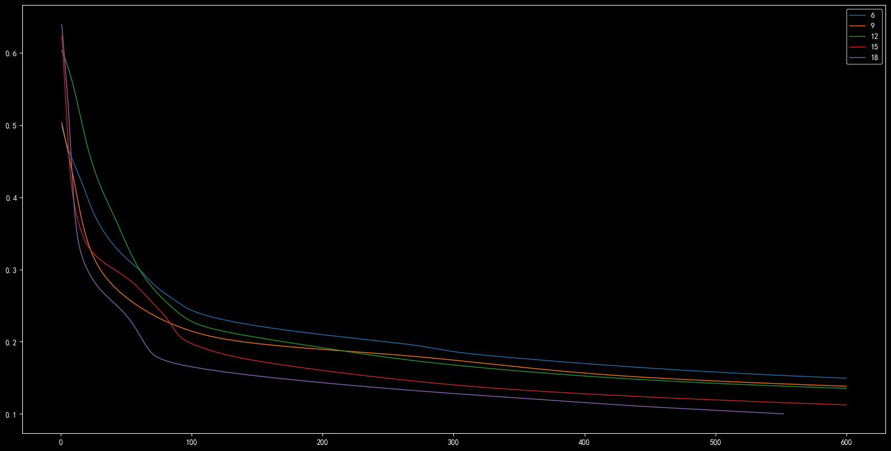
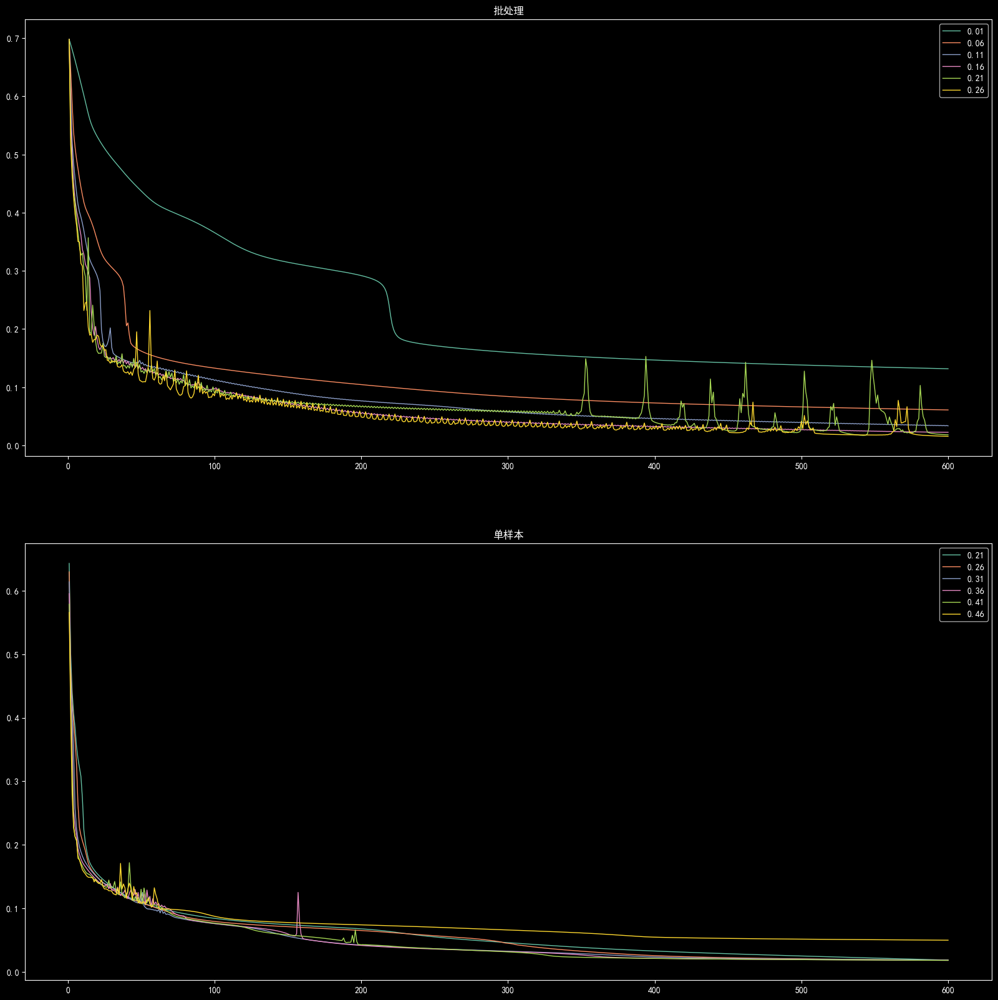
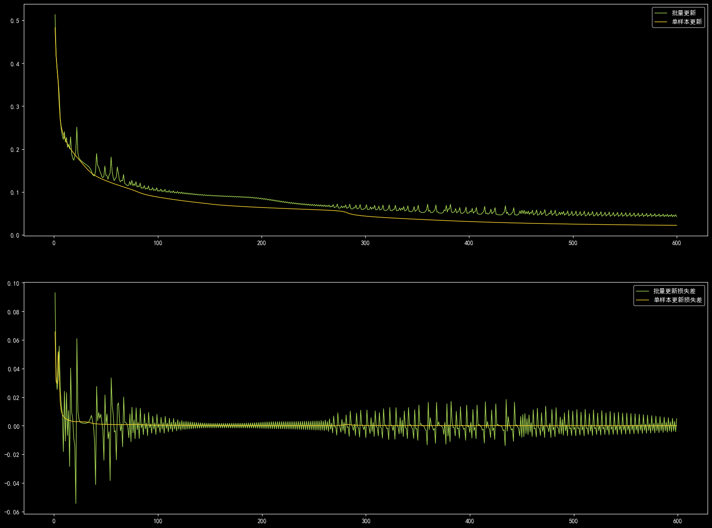

# 作业四

## 第一部分

### 1.1

$
\displaystyle \Delta w_{hj} = -\eta \frac{\partial J(W)}{\partial w_{hi}}=-\eta\frac{\partial J}{\partial z_j}\frac{\partial z_j}{\partial net_j}\frac{\partial net_j}{\partial w_{hj}}=\eta(t_j-z_j)\Big(\frac{e^{net_j}}{\sum_j e^{net_j}}-\big(\frac{e^{net_j}}{\sum_j e^{net_j}}\big)^2\Big)f(net_h) \\
\Delta w_{ih} = -\eta \frac{\partial J}{\partial w_{ih}} = -\eta \frac{\partial J}{\partial net_h} \frac{\partial net_h}{w_{ih}} = -\eta \sum\limits_j\frac{\partial J}{\partial net_j}\frac{\partial net_j}{\partial net_h}v_i = -\eta\Big(f(net_h)\big(1-f(net_h)\big)\Big)v_i\sum\limits_j\frac{\partial J}{\partial net_j}w_{hj}
\\
总结：\\
i表示输入层节点，h表示隐藏层节点，j表示输出层节点。f(x)表示sigmoid函数。\\
net_j=\sum_h w_{hj}f(net_h),\quad net_h = \sum_i w_{ih}v_i \\
-\frac{\partial J}{\partial net_j} = (t_j-z_j)\Big(\frac{e^{net_j}}{\sum_j e^{net_j}}-\big(\frac{e^{net_j}}{\sum_j e^{net_j}}\big)^2\Big) \\
\Delta w_{hj} = -\eta\frac{\partial J}{\partial net_j}f(net_h) \\
\Delta w_{ih} = -\eta\Big(f(net_h)\big(1-f(net_h)\big)\Big)v_i\sum\limits_j\frac{\partial J}{\partial net_j}w_{hj}
$

### 1.2

总结：先计算结果然后求出输出层节点的误差，然后从上到下对每层通过计算的误差传递系数接受来自上一层误差，然后作为当前层系数矩阵的更新差。

$
\displaystyle
\Delta w_{hj} = -\eta\frac{\partial J}{\partial net_j}f(net_h) \\
隐藏层到输出层的权重更新：利用隐藏层的输出和输出层误差梯度进行更新。\\
\Delta w_{ih} = -\eta v_if^{\prime}(net_h)\sum\limits_j\frac{\partial J}{\partial net_j}w_{hj} \\
输入层到隐藏层的权重更新：收集输出层的误差梯度作为隐藏层节点的误差梯度，接着使用输入层的输出和隐藏层的误差梯度进行更新。\\
\\\;\\
\bold{哪些因素会对网络的性能产生影响}: 激活函数f、\eta、初始值v、初始权重w。
$

## 第二部分

### 2.1

见4.ipynb

### 2.2

#### a)

（1）大体上迭代次数相同且足够多时，节点数越多、平方误差越小。

（2）大体上节点数越多、迭代次数越少。

以下是 批处理更新、步长为0.01所绘制的图像

#### b)

- 更新步数的增加可以加快开始时的平方误差的下降。
  - 分析：这可能是由于在刚开始与最终目标相差较大、跨幅较大平方误差也在呈现降低趋势。
- 更新步数增加的时候 会引起震荡的情况。
  - 分析：这可能是由于增量太大然后不断跨过最终目标。
- 震荡现象在批处理方式下的更新步数最低值 小于 单样本更新方式下的更新步数最低值。
- 在在迭代次数较大的时候 震荡现象出现的频率 单样本更新时 低于 批处理更新。
  - 分析：这可能是由于单样本每个样本都对系数矩阵进行更新、弱化了更新步数对时影响。

以下是 隐藏层10个节点所绘制的图像

#### c)

以下是隐藏层10个节点、更新步长0.2对单样本更新、批处理更新方法所绘制的图像曲线。

上半部分是目标函数随迭代步数增加的变化曲线。

下半部分是随着迭代步数增加，相邻两次之间的目标函数差值。

