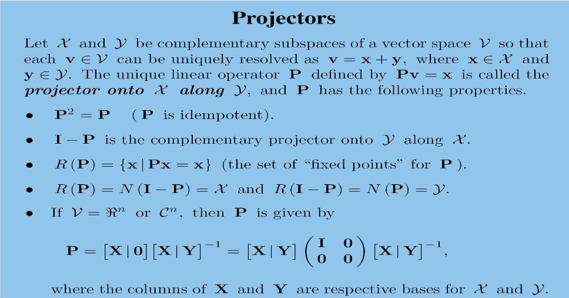

# 笔记

## 线性方程组

- **Gaussion**:
  - multiplications/divsions : $\frac{n^3}{3} + n^2 - \frac{n}{3}$
  - additions/subtractions : $\frac{n^3}{3}+\frac{n^2}{2}-\frac{5n}{6}$
- **Gauss-Jordan** :
  - At each step, the pivot element is forced to be 1.
  - At each step, all terms above the pivot as well as all terms below the pivot are aliminated.
  - multiplications/divsions : $\frac{n^3}{2} + \frac{n^2}{2}$
  - additions/subtractions : $\frac{n^3}{2}-\frac{n}{2}$
- **Partial Pivoting**
- **Complete Pivoting**
- **III-Conditioned Linear Systems**
  - A system of linear equations is said to be **$ill-conditoned$** when some small perturbation in the system can produce relatively large changes in the exact soluton. Otherwise, the system is said to be ***well-conditioned.***
- **Rank of a Matrix**
  - number of pivots
  - number of nonzero rows in E
  - number of basic columns in A

## 矩阵代数

- **Conjugate Transpose(共轭转置)** :
  - $[A^{*}]_{ij}=\vec{a}_{ji}$

- **Linear Functions**  :
  - for every x and y in $\mathcal{D}$ and for all scalars $\alpha$. the two conditions(加法和数乘) may be combined by saying thaf $f$ is a linear funciton whenever
  - $f(\alpha x + y)=\alpha f(x) + f(y+y) \quad \forall \rm{\;scalars\;} \alpha,\;x,y\in\mathcal{{D}} $

- **Matrix Multiplication** :
  - $[AB]_{ij}=A_{i*}B_{*j}=<A_{i*},B_{*j}^T>$
  - $[AB]_{i*}=A_{i*}B=\{A_{i*}B_{*1}, A_{i*}B_{*2},\dots\}$
  - $[AB_{*j}]=AB_{*j}=\{A_{1*}B_{*j}, A_{2*}B_{*j},\dots\}$
  - $[AB]_{i*}=B的每行的线性组合=\sum_{k=1}^p a_{ik}B_{k*}$
  - $[AB]_{*j}=A的每列的线性组合=\sum_{k=1}^p A_{*k}b_{kj}$

- **Existence of an Inverse** : 以下条件互相等价
  - $A^{-1}$ exists
  - rank(A)=n  
  - $A\xrightarrow{Gauss-Jordan}{}I$
  - Ax=0 implies that x = 0

- **Inverses of Sums** :
  - $(I+cd^T)^{-1}=I-\frac{cd^T}{1+d^Tc}$
  - $(A+cd^T)^{-1}=A^{-1}-\frac{A^{-1}cd^TA^{-1}}{1+d^TA^{-1}c}$
  - $(A+CD)^{-1}=A^{-1}-A^{-1}C(I+D^TA^{-1}C)^{-1}D^TA^{-1}$
  - $B=A+\alpha e_ie_j \quad B^{-1}=A^{-1}-\alpha\frac{[A^{-1}]_{*i}[A^{-1}]_{j*}}{1+\alpha [A^{-1}]_{ji}}$

- **Neumann Series** :
  - If $\lim_{n\to\infin}A^n=\mathcal{0},\rm{then\;} (I-A)^{-1}=\sum_{k=0}^\infin A^k \approx I+A$
  - IF $\lim_({A^{-1}B})^n=\mathcal{0},\rm{then\;} (A+B)^{-1}=(I-[-A^{-1}B])^{-1}A^{-1} = \Big(\sum_{k=0}^\infin[-A^{-1}B]^k\Big)A^{-1} \approx A^{-1}-A^{-1}BA^{-1}$

- **Equivalence(等价)**
  - $A\sim B \Longleftrightarrow PAQ=B\quad \rm{where\;} P,Q \rm{is\;nonsigngular}$
  - $A\stackrel{row}{\sim} B \Longleftrightarrow PA=B$
  - $A\stackrel{col}{\sim} B \Longleftrightarrow AQ=B$

- **LU Factorization**
  - **只使用一行加x倍到另一行中的基本初等变换(第三类？)**。
    - $G_n\dots G_3 G_2 G_1 A = U 上三角矩阵$
    - $L = G_1^{-1}G_2^{-1}G_3^{-1}\dots G_n^{-1} = 下三角矩阵$
    - 存在条件：
      - 消的时候没有连续的0（大概是这意思）、
      - Each leading principal submatrix $A_k$ is nonsingular.
  - $有行交换的LU分解 PA=LU$
    - A添加一列表示 行的位置，$[A|p]=LU\quad PA=LU$
    - 
  - LDU分解
    - 将 $U=DU^{'} \; D是个对角阵.$
    - 唯一性条件 ?

- 其他点
  - $(AB)^T =B^TA^T$
  - $(AB)^{-1}=B^{-1}A^{-1}$
  - trace(AB)=trace(BA)
  - Ax=b 以及轻微扰动 (A+B)$\tilde{x}=b$ 中 $x-\tilde{x}=A^{-1}b-(A+B)^{-1}b\approx A^{-1}Bx$
    - $||x-\tilde{x}||\lesssim ||A^{-1}||\;||B||\;|| x||$
    - $\frac{||x-\tilde{x}||}{||x||}\lesssim ||A^{-1}||\;||B||=\kappa \{\frac{||B||}{||A||}\}$

## 向量空间

- **向量空间的定义**
  - 加法封闭、加法结合律、加法分配律、存在0元、存在加法逆元。
  - 数乘封闭、数乘结合律、数乘分配律、数乘分配律、存在单位元。
  - 向量加法($x+y$) 是 $\mathcal{V}$中的元素进行的操作。
  - 标量乘法($\alpha x$) 是 $\mathcal{F} 和 \mathcal{{V}}中的元素进行的操作$
- **子空间(Subspaces)**
  - $\mathcal{S}\subseteq \mathcal{V}$
    - 只要$\mathcal{S}$中的元素满足加法封闭性和数乘封闭性就称其为$\mathcal{V}$的子空间 (其是一个闭包子集？类似坐陪集？)
- **$span(\mathcal{S})$**
  - $\mathcal{{S}} = \{v_1,v_2,\cdots, v_r\}$
  - $span(\mathcal{S})=\{\alpha_1 v_1 + \alpha_2 v_2 + \cdots + \alpha_r v_r | \alpha_i \in \mathcal{F}\}$
    - $是\mathcal{S}中的元素在给定运算\mathcal{F}的线性组合$
    - In fact, all subspacexs of $\mathcal{R}^n$ are of the type $span(\mathcal{S})$
  - Spanning Sets
    - $\mathcal{S} \rm{\;spans\;} \mathcal{V}$ whenever each vector in $\mathcal{V}$ is al inear combination of vectors form $\mathcal{S}$
- **Column and Row Spaces**
  - $R(A)$ = te sapce spanned by the columns of A (column space)
  - $R(A^T)$ = the sapce spanned by the rows of A (row space)
  - $b \in \, R(A) \implies \; b = Ax $ for some x.
  - $a \in \, R(A^T)\implies \; a^T = y^TA$ for some $y^T$.
- **Null spaces**
  - $N(A)$
  - $N(A^T)$
- **向量空间相似问题**
  - $A \stackrel{row}{\sim} B \implies N(A)=N(B) \implies R(A^T)=R(B^T)$
  - $A \stackrel{col}{\sim} B \implies R(A)=R(B) \implies N(A^T)=N(B^T)$
- **Linear Independence**
  - 向量是否可以由其他向量线性表出。
- **Basis and Dimension**
  - 一个向量空间的 线性无关的 张成集合 称为 向量空间的一组基
  - 每个向量空间 产生 一组基
  - Characterizations of a basis
    - 假设 $\mathcal{B}$ is $\mathcal{V}$ 的一组基
      - $\mathcal{B}$ 是 $\mathcal{V}$ 的最小张成集合
      - $\mathcal{B}$ 是 $\mathcal{V}$ 的最大线性独立子集
  - Dimension
    - $\begin{aligned} \rm{dim}\mathcal{V} &= \rm{number\;of\;vectors\;in\;any\;basis\;for} \mathcal{V} \\ &=\rm{number\;of\;vectors\;in\;any\;minimal\;spanning\;set\;for\;} \mathcal{V} \\ &=\rm{number\;of\;vectors\;in\;any\;maximal\;independent\;subset\;for\;}\mathcal{V}\end{aligned} $
    - Dimension is in terms of **degrees of freedom**.
    - 假设 A is m x n matrix, rank(A) = r
      - dim R(A) = r
      - dim N(A) = n - r
      - dim R(A^T) = r
      - dim N(A^T) = m-r
      - 子空间计算问题。
- **Others**
  - 1
    - A 是 m x n矩阵
    - $N(A)=\{0\} \implies rank(A)=n$
    - $N(A^T)=\{0\} \implies rank(A)=m$
  - **对角占优矩阵（Diagonally dominant matrice）**
    - all diagonall dominant matrices are nonsingular.
  - **Vandermonde Matrices**
  - Maximal Independent Subsets
  - Basic Facts of Independence
    - 一组向量线性独立，那么每一个子集线性独立
    - 当且仅当v不是 span(S)， $S\cup \{v\}$线性独立
  - Wornski matrix
  - Rank and Connectivity
    - 构建点边矩阵（一条边 起始点 1 终止点 -1）
    - rank(E) = m-1 $\implies$ G is connected
  - $dim(\mathcal{X} + \mathcal{Y})=dim \mathcal{X} + dim \mathcal{Y} - dim(\mathcal{X}\cap\mathcal{Y})$
  - rank(A+B) $\le$ rank(A) + rank(B)
  - R(A+B) $\subseteq$ R(A) + R(B)
  - $\bold{rank(AB) = rank(B) - dim N(A)\cap R(B)}$
    - 容斥原理 ？ => AB的值域空间 = B的值域空间 - B的值域空间中是A的零空间的部分.
    - rank(AB) $\le$ min{rank{A}, rank{B}}
    - rank(A) + rank(b) - n $\le$ rank(AB)
  - $\bold{rank(A^TA) = rank(A) = rank(AA^T)}$
    - $\bold{R(A^TA) = R(A^T)}$
    - $\bold{N(A^TA) = N(A)}$
    - 最小二乘解中 值域包含关系
  - **rank(A+E) $\bold{\ge}$ rank(A) whenever E has entries of small magnitude.**

## 线性变换

- **Linear Transformations**
  - Let $\mathcal{U}$ and $\mathcal{V}$ be vector spaces over afield $\mathcal{F}$
    - A **linear transformation** form $\mathcal{U}$ into $\mathcal{V}$ is defined to be a linear function $\mathcal{T}$ mapping $\mathcal{U}$ into $\mathcal{V}$.
      - $\mathcal{T}(x+y)=\mathcal{T}(x)+\mathcal{T}(y)$ and $\mathcal{T}(\alpha x) = \alpha\mathcal{T}(x)$
      - or $\mathcal{T}(\alpha x + y) = \alpha \mathcal{T}(x) + \mathcal{T}(y) \rm{\;for\;all\;}x,y\in\mathcal{U},\alpha\in\mathcal{F}$
  - **Linear transformations on finite-dimensional spaces will always have matrix representations.**
- $[A]_\mathcal{B} = P^{-1}[A]_\mathcal{B'}P, $ where $P = [I]_\mathcal{BB'}$
  - $Y^{-1}X\; X^{-1}AX = Y^{-1}AY \;Y^{-1}X$
  - $L = AI = IA 一样。$
  - $[A]_I = A = [I]_{I\mathcal{B}}^{-1}[A]_\mathcal{B}[I]_{I\mathcal{B}}$
    - $[A]_\mathcal{B} 是A的特征向量构成的矩阵,Ax=\lambda_ix => = B^{-1}AB=特征值构成的矩阵$
      - 将A分解成多个不变子空间的形式？
- **Similarity**
  - 上面的
- **Invariant Subspaces(不变子空间)**
  - $T(\mathcal{X}) = \{T(x)\;|\;x\in \mathcal{X} \} \subseteq \mathcal{X}$
  - 
  - 变换T在$\mathcal{V}$空间下的矩阵表示$[T]_\mathcal{B}$中部分的不变子空间的矩阵形式可以简化
  
- **Others Tiny**
  - $[v]_\mathcal{B}$
    - if $\mathcal{B} = \{u_1,u_2,\cdots,u_n\}$ and $v = \alpha_1u_1 + \alpha_2 u_2 + \cdots + \alpha_nu_n$, then $[v]_\mathcal{B}$ = $(\alpha_1,\alpha_2,\cdots,\alpha_n)^T$
  - **Space of Linear Transformations**
    - $\mathcal{L}(\mathcal{U}, \mathcal{v})$
  - $[T]_{\mathcal{B}\mathcal{B'}}$
    - Let $\mathcal{B} = \{u_1,u_2,\dots,u_n\}, \;\mathcal{B'}=\{v_1,v_2,\dots,v_m\}$ be bases for $\mathcal{u}$ and $\mathcal{V}$
    - $[T]_{\mathcal{B}\mathcal{B'}} = \Big([T(u_1)]_{\mathcal{B'}} | [T(u_2)]_{\mathcal{B'}} | \cdots| [T(u_n)]_{\mathcal{B'}} \Big) = \mathcal{B'}^{-1}T[\mathcal{B}]$
    - $[T]_\mathcal{B} = [T]_\mathcal{BB}$
    - $[T(u)]_\mathcal{B'} = [T]_\mathcal{BB'}[u]_\mathcal{B}$
    - $变换C = LT \quad [C]_\mathcal{BB"} = [L]_\mathcal{B'B"}[T]_\mathcal{BB'}$
    - $[T^{-1}]_\mathcal{B} = [T]_\mathcal{B}^{-1}$
  - 假设$\mathcal{B} = \{x_1,x_2,\cdots,x_n\} = X,  \mathcal{B'}=\{y_1,y_2,\cdots,y_n\} = Y$
    - $T(y_i) = x_i, \quad i = 1,2,\cdots,n$
      - $[T]_\mathcal{B} = [T]_\mathcal{BB} = Y^{-1}X$
      - $[T]_\mathcal{B'} = [T]_\mathcal{B'B'} = Y^{-1}X \quad\{将输入的\mathcal{B'}坐标经过T变换后.....\}$
      - $[I]_\mathcal{BB'} = Y^{-1}X \quad \{将输入的\mathcal{B}坐标转换为基本正交基下的坐标再转换为\mathcal{B'}下的坐标\}$
      - $\bold{对任意变换T来说[T]_\mathcal{BB'}=Y^{-1}\,T\,X}\quad\{其中T是变换的矩阵表达形式，Y是\mathcal{B'}的基矩阵，X是\mathcal{B}的基矩阵\}$
      - $\bold{上述假设T变换的矩阵表达形式：T=XY^{-1}}$
        - $[T]_\mathcal{BB} = X^{-1}\,T\,X = Y^{-1}X$
        - $[T]_\mathcal{B'B'} = Y^{-1}\,T\,Y = Y^{-1}X$
        - $[I]_\mathcal{BB'} = Y^{-1}X$

## 模和内积

- **General Vector Norms(向量模/范数的一般性定义)**
  - $范数||*||是对*的从\mathcal{V}空间向实数空间的一组定义，其满足以下条件：$
    - $||x|| \ge 0 ,\quad ||x||=0\Longleftrightarrow x = 0$.
    - $||\alpha x|| = |\alpha|\,||x||$ for all scalars $\alpha$.
    - $||x+y|| \le ||x||+||y||$
  - Other Timy中定义的Euclidean Vector Norm 和 p-Norms 均满足以上定义。
- **General Matrix Norms**
  - A **matrix norm** is a function $||*||$ from the set of all complex matrices(of all finite orders) into $\mathcal{R}$ that satisfies the following properties
    - $||A|| \ge 0,\quad ||A||=0 \Longleftrightarrow A = \mathcal{0}$
    - $||\alpha A|| = |\alpha|\,||A||$
    - $||A+B|| \le ||A|| + ||B||$
    - $||AB|| \le ||A||\,||B||$
    - Forbenius norm满足以上定义
- **GeneralInner Product**
  - <x|x> is real with <x|x> $\ge$ 0 and <x|x> = 0 $\Longleftrightarrow$ x = 0.
  - <x|$\alpha$ y>=$\alpha$<x|y>  for all scalars $\alpha$
  - <x|y+z> = <x|y>+<x|z>
  - <x|y>=$\overline{\rm{<y|x>}}$  
- Orthogonality
  - x $\perp$y $\Longleftrightarrow$ <x|y> = 0
  - Angles
    - $cos\theta = \frac{<x|y>}{||x||\,||y||}$
  - 正交基
- 傅里叶展开
  - x在一系列正交基下的坐标$x=<\mu_1|x>\mu_1 + <\mu_2|x>\mu_2 + \cdots + <\mu_n|x>\mu_n$
- **QR factors**
  - QR分解形式**唯一！**
  - Gram-Schmidt Proceduce
    - $u_k = \frac{x_k-\sum_{i=1}^{k-1}<u_i|x_k>u_i}{||x_k-\sum_{i=1}^{k-1}<u_i|x_k>u_i||} = \frac{(I-U_kU_k^*)x_k}{||(I-U_kU_k^*)x_k||}$
    - 算法流程
      - $u_k = x_k - \sum_{i=1}^{k-1}<u_i|x_k>u_i$
      - $u_k = \frac{u_k}{||u_k||}$
    - 形成的矩阵形式：A = QR    A：列向量线性无关，Q正交矩阵，R上三角矩阵。
  - Modified Gram-Schmidt Algorithm
    - $u_k=\frac{E_k\cdots E_2 E_1 x_k}{||E_k\cdots E_2 E_1 x_k||}$ with $E_1 = I$, $E_i=I-u{i-1}u_{i-1}^*$
  - Householder reduction:
    - 使用 反射矩阵 将每行 反射到标准正交基上。
    - PA = T 其中 P是一系列正交矩阵的连乘积 T 是上三角矩阵
  - Givens reduction：
    - 使用 旋转矩阵，逐个旋转。
  - QR分解与最小二乘解
    - $x = (A^TA)^{-1}A^Tb = R^{-1}Q^Tb$
- Complementary Subspaces
  - 并全集，交只有0
  - Projection：
    - 
    - 一个线性变换P在$\mathcal{V}$ 是投影矩阵 当且仅当 $P^2=P$
      - $P^2=P \implies R(P) 和 N(P)是互补子空间$
  - Index:
    - 当$rank(A^k)=rank(A^{k+1})时$ $R(A^k) = R(A^{k+1})\, N(A^k)=N(A^{k+1})\, R(A^k)\cap N(A^k)=0\,$
  - Range-Nullspace Decomposition
    - $rank(A^k)=r\,k = indeak(A) \implies Q^{-1}AQ=\left(\begin{matrix}C_{\rm{r\,n\,r}} & 0 \\ 0 & N\end{matrix}\right)$
    - $A^D = Q\left(\begin{matrix}C^{-1} & 0 \\ 0 & 0 \end{matrix}\right)$
  - 正交补空间：
    - $R(A)^\perp = N(A^T),\quad N(A)^\perp = R(A^T)$
    - URV Factorization：
      - $A = URV, U是由R(A)以及R(A)^\perp=N(A^T)组成，V是由N(A)以及N(A)^\perp = R(A^T)组成$
- **Other Tiny**
  - Vector Norms
    - Euclidean Vector Norm
      - $||x|| = \Big(\sum_{i=1}^n|x_i|^2\Big)^{1/2}=\sqrt(x^*x)$
        - $||x|| \ge 0 ,\quad ||x|| = 0 \Longleftrightarrow x = 0$
    - Standard Inner Product
      - $x^Ty = \sum_{i=1}^nx_iy_i$
    - CBS inequality
      - $|x^*y| \le ||x||\;||y||$
    - Triangle Inequality
      - $||x+y|| \le ||x|| + ||y||$
    - p-Norms
    - $||x||_p=\Big(\sum_{i=1}^n|x_i|^p\Big)^{1/p}$
      - $||x||_p \ge 0 , \quad ||x||_p = 0 \Longleftrightarrow x = 0$，满足三角不等式
      - $||x||_1 \ge ||x||_2 \ge ||x||_\infin$
- Matrix Norms
  - Frobenius Matrix Norm
    - $||A||_F^2=\sum\limits_{i,j}|a_{ij}|^2=track(A^*A)$
      - $||AB||_F \le ||A||_F||B||_F$
    - Induced Matrix Norms
      - $||A|| = \underset{||x||=1}{max}||Ax||$ for A $\in\,\mathcal{C}^{\rm{m\,x\,n}},\;x\in\mathcal{C}^{\rm{n\,x\,1}}$
      - $||A||_p=\underset{||x||_p=1}{max}||Ax||_p$
        - $||A||_2 = \sqrt{\lambda_{max}}$
        - $||A||_1 = 最大列的绝对值和$
        - $||A||_\infin = 最大行的绝对值和$
  - Inner Produce
    - Standard Inner Products <x|y> = x^*y
    - if $A_{\rm{n\,x\,n}}$ is a nonsigular matrix, then <x|y> = $(Ax)^*(Ay)$ = $x^*A^*Ay$
    - <A|B> = $track(A^TB)$
    - General CBS Inequality
      - $|<x|y>| \le \sqrt{<x|x>}\sqrt{<y|y>}$
  - 正交矩阵 行是一组正交基，列也是一组正交基，其对x的变换保长度$||Ux||_2 = ||x||_2$
  - 投影矩阵
    - $Q = I-u^*u\quad ||u||=1, Q^k = Q, k >= 1$
    - $Q = I-\frac{u^*u}{uu^*}$
  - 反射矩阵
    - $R=I-2\frac{u^*u}{uu^*}$
      - 当 $u=\frac{v}{||v||} + \frac{x}{||e_1||}时, Rv = -||v||\frac{x}{||x||}$
    - $R^2=I， P=P^*, P是正交对称矩阵$
